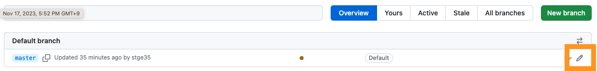
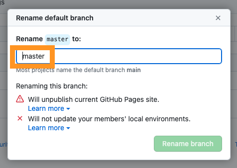

> ##### 이 포스팅은 스스로 학습을 하고 관련 내용을 복습하기 위해 작성한 글입니다.   
> ##### 잘못된 부분이 있을 경우 댓글 및 메일로 지적해주시면 감사합니다^^
 
기존에 Github 를 이용하여 repository 를 생성을 하면 기본 브랜치 명이 master 였으나 IT에서도 Black Lives Matter 운동의 영향으로 
사용되는 용어에도 변화가 필요하다는 의식이 생기고 기존의 브랜치명을 master에서 main으로 변경하였습니다.
간혹 master 라고 되어 있는 부분을 수정하지 않아 나중에 수정하려고 했을 때 방법입니다.

### 기존의 Repository 의 브랜치 이름 변경 (master -> main)

1. 변경 하려는 **Repository** 로 이동한 후 왼쪽 상단의 [branch] 메뉴를 클릭.

2. 오른쪽의 **연필모양 아이콘** 을 선택.

3. master 를 main으로 변경 후 **Rename branch** 클릭.

4. **로컬 Repository** 에서 아래의 **명령어** 를 차례대로 실행해 업데이트를 합니다.

> $ git branch -m master main  
> $ git fetch origin  
> $ git branch -u origin/main main  
> $ git remote set-head origin -a